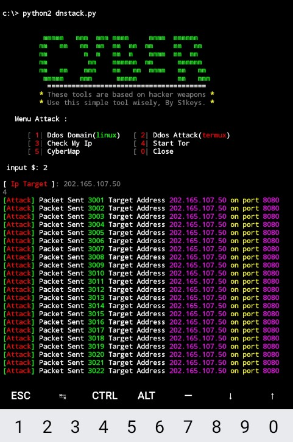
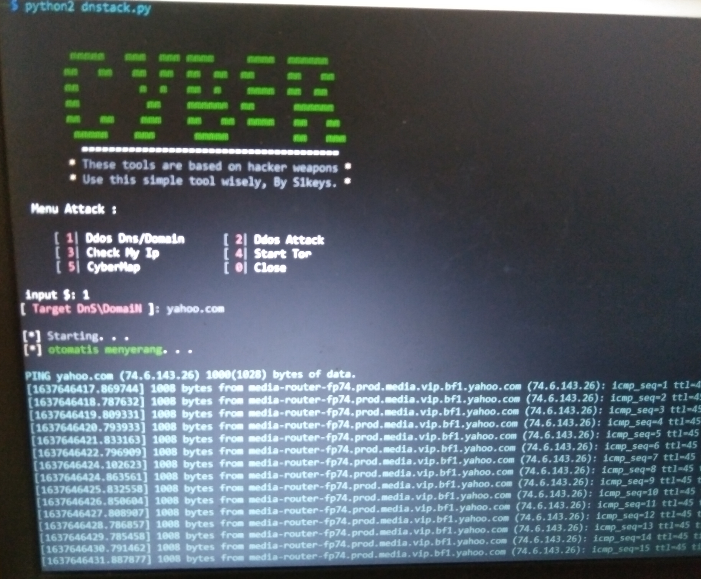

# DdoS Attack 

mungkin beberapa dari generasi baru yang terjun ke dunia Cyber untuk pertama kalinya, beberapa dari mereka kesulitan saat menginstal atau menjalankan perintah termux atau di terminal saya sediakan cara penginstalan nya sangat lah mudah..

material installation in Termux 🤖

$ pkg update && pkg upgrade
$ pkg install python2
$ pkg install curl
$ pkg install git

material installation in Linux 🤖

$ sudo apt-get update && upgrade
$ sudo apt-get install curl
$ sudo apt-get install python2.7
atau
$ sudo apt-get install python-minimal

Fitur-fiturnya berdasarkan Senjata ddos
================================

A) Ddos DNS/Domain ( untuk Linux )

B) Ddos Address Attack ( untuk termux )

C) IP public viewer ( menampilkan IP publik tracker lokasi anda )

D) Start tor browser ( menginstal tor dan menjalankan di termux & di Linux )

E) CyberMap (  untuk melihat serangan beda server apakah berhasil? disarankan untuk memakai tor atau VPN saat menyerang! )

================================

cara menggunakan nya di termux

cara menggunakan nya di kali linux 

Oke Seperti nya Saya Sudah Memberikan semua informasi tentang tools ini silahkan jika mau bergabung dengan team kami di grub WhatsApp berikut ini😁🤗

https://chat.whatsapp.com/LoJEvYFHSxKDS7mU6BfJxt 😎

Donate 💰: https://bit.ly/3xgl5LV

💪Subscribe juga YouTube kami🤖
https://youtu.be/yhdAT-gNN_E 👊

